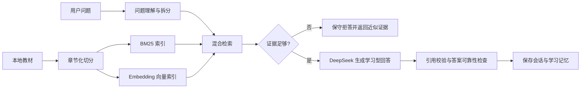

# 高项 RAG Agent

面向中国软考**信息系统项目管理师（高级）**的学习型 RAG 知识库。项目以《信息系统项目管理师辅导教程》第 3 版为主要本地资料，提供书本知识检索、引用追溯、章节复习和学习记忆能力。

项目当前以 Python 命令行为主，使用 LangChain 和 LangGraph 编排检索与回答流程。

## 项目状态

核心学习与检索链路已完成，当前适合本地学习、技术验证和面试展示：

- 文档切分：按章节、小节和原文位置生成可追溯 chunk。
- 混合检索：BM25 关键词检索 + 豆包 Embedding/Chroma 向量检索。
- 查询理解：问题类型识别、查询增强、章节过滤和上下文追问补全。
- 多问题处理：一次输入多个问题，拆分后分别检索并统一组织回答。
- 可靠回答：证据阈值、术语覆盖率、严格引用校验和证据不足拒答。
- 学习记忆：会话历史、上一轮查看、上一轮回退和长期学习画像。
- 成本控制：查询 Embedding 缓存、检索自救、BM25 降级和上下文裁剪。
- 请求治理：超时、有限重试、熔断、异常日志、请求统计和保守降级。
- 评估体系：检索评估、答案可靠性评估、引用评估、索引健康检查和离线回归。
- LangGraph：使用状态图管理查询、检索、生成、校验、记忆和最终响应。

当前限制：暂无 Web UI，尚未产品化为 HTTP 服务；长期记忆回退的一致性重算和生产级多租户部署仍属于后续增强方向。

## 工作流



## 目录结构

```text
.
├── code/       # 教学版代码、RAG 主流程、评估和回归测试
├── docs/       # 项目目标、系统设计、需求、实现、测试和变更文档
├── notes/      # 流程图、学习讲义和评估数据
├── test/       # 外部资料整理及压力测试脚本
├── source_docs/ # 本地教材目录，不提交到 GitHub
├── indexes/    # 本地 BM25/Chroma 索引，不提交到 GitHub
├── memory/     # 本地学习记忆，不提交到 GitHub
├── sessions/   # 本地会话过程，不提交到 GitHub
├── outputs/    # 本地回答和评估输出，不提交到 GitHub
└── logs/       # 本地运行日志，不提交到 GitHub
```

## 环境要求

- Python 3.11+
- 建议使用虚拟环境
- 需要向量检索时：豆包 / 火山方舟 Embedding API
- 需要生成式回答时：DeepSeek API
- 只做 BM25 检索和部分离线回归时，可以不配置 API Key

## 快速开始

### 1. 安装依赖

```bash
git clone git@github.com:Dominic106/gaoxiang-rag-agent.git
cd gaoxiang-rag-agent

python3 -m venv code/.venv
source code/.venv/bin/activate
python -m pip install --upgrade pip
pip install -r code/requirements.txt
```

### 2. 配置 API

```bash
cp code/.env.example code/.env
```

编辑 `code/.env`，填写自己的 API Key 和 Embedding endpoint。不要把 `code/.env` 提交到 GitHub。

### 3. 准备本地资料

将自己拥有使用权的教材或学习资料放入：

```text
source_docs/信息系统项目管理师辅导教程第3版全版/
```

默认代码会读取该目录下的 Word 文档。公开仓库不包含教材正文，请自行确认资料版权和使用授权。

### 4. 构建文档和索引

```bash
cd code
source .venv/bin/activate

python 01_build_chunks.py
python 02_build_indexes.py
```

没有配置 API Key 时，项目仍可建立 BM25 关键词索引；配置豆包 Embedding 后会继续生成 Chroma 向量索引。

### 5. 运行提问

只查看关键词检索结果：

```bash
python 04_keyword_search_demo.py "范围基准"
```

运行完整 RAG：

```bash
python 03_query_graph.py "什么是范围基准？包括哪些内容？"
```

一次提问多个问题：

```bash
python 03_query_graph.py "1. 什么是范围基准？ 2. 定性风险分析和定量风险分析有什么区别？"
```

带会话记忆和章节过滤：

```bash
python 03_query_graph.py --session gaoxiang-study --chapter "第17章" "项目章程的作用是什么"
python 03_query_graph.py --session gaoxiang-study --last
python 03_query_graph.py --session gaoxiang-study --back
```

## 主要脚本

| 文件 | 用途 |
| --- | --- |
| `code/01_build_chunks.py` | 从本地教材生成章节化 chunks |
| `code/02_build_indexes.py` | 建立 BM25 和 Chroma 索引 |
| `code/03_query_graph.py` | LangGraph 完整查询入口 |
| `code/04_keyword_search_demo.py` | 无 API Key 的关键词检索 |
| `code/05_retrieval_graph_demo.py` | LangGraph 检索报告 |
| `code/06_answer_graph_no_key.py` | 无 Key 的抽取式回答 |
| `code/07_eval_retrieval.py` | 批量检索评估 |
| `code/08_interactive_cli.py` | 交互式命令行学习 |
| `code/09_test_doubao_embedding.py` | 豆包 Embedding 连通性测试 |
| `code/10_eval_hybrid_retrieval.py` | BM25、向量和混合检索对比 |
| `code/16_eval_answer_reliability.py` | 答案可靠性评估 |
| `code/17_index_health.py` | 索引健康检查和版本对比 |
| `code/21_service_interface_regression.py` | 稳定服务接口回归 |
| `code/rag_service.py` | 统一的本地服务接口 |

## 测试与质量检查

离线回归测试不调用外部模型：

```bash
cd code
pytest -q test_offline_regressions.py
```

可选静态检查：

```bash
ruff check .
mypy . --ignore-missing-imports
pyright . --level error
flake8 .
```

完整项目文档入口：

```text
docs/00_项目文档索引.md
```

## 安全与版权

- API Key 只放在本地 `code/.env` 或部署环境变量中。
- 不要提交 `.env`、个人学习记忆、会话记录、运行日志和 API 返回内容。
- 教材原文、真题和外部资料需要自行确认版权、授权和平台使用规则。
- 当前仓库暂未附带开源许可证；在公开发布教材数据或商业化使用前，请先完成版权和合规确认。

## 后续方向

1. 将本地 `rag_service.py` 封装为 FastAPI 服务。
2. 增加 Web UI，后续再评估微信小程序形态。
3. 完善长期记忆的版本化、回退和一致性重算。
4. 增加选择题、计算题、错题本和模拟考试模块。
5. 继续扩大软考知识点、真题和学习场景评估集。
