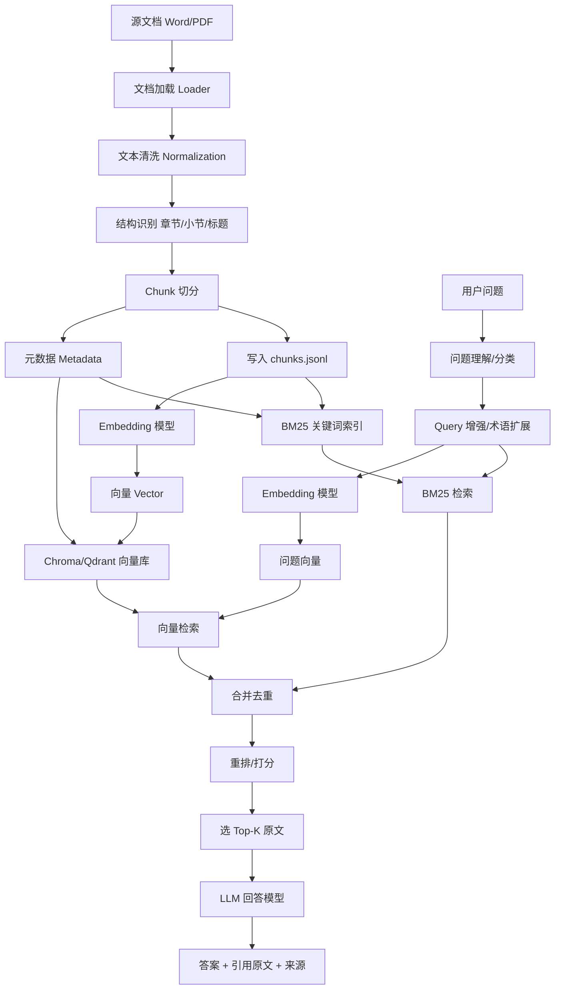
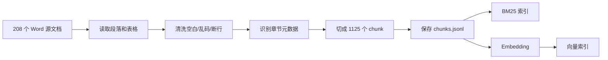
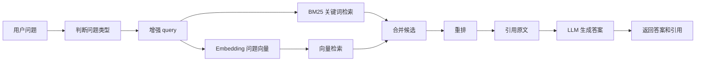

# RAG 知识库完整流程图

## 总览



## 离线建库阶段



## 在线问答阶段



## 模型分工

```text
Embedding 模型：
  负责把 chunk 和用户问题变成向量。
  用于语义检索。

LLM 回答模型：
  负责阅读检索到的原文。
  用于组织答案、解释、总结、按考试方式讲解。
```

## 当前项目状态

```text
已完成：
  Word 读取
  chunk 切分
  BM25 中文索引
  问题理解
  无 Key 检索报告
  无 Key 抽取式回答
  批量评估

未完成：
  embedding 向量索引
  Chroma 语义检索
  LLM 最终回答
```
