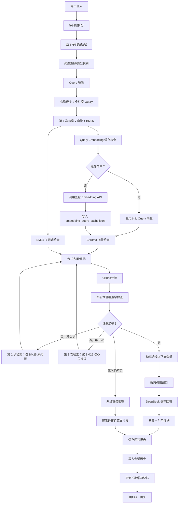
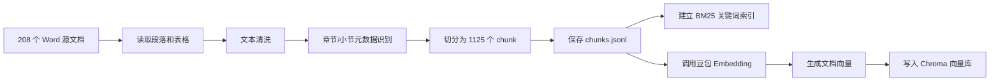
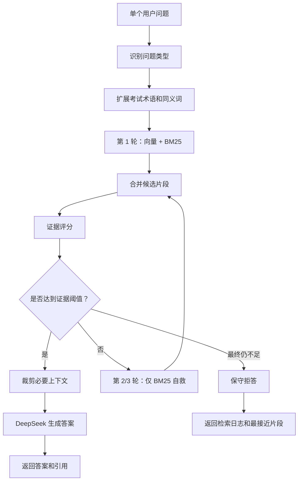
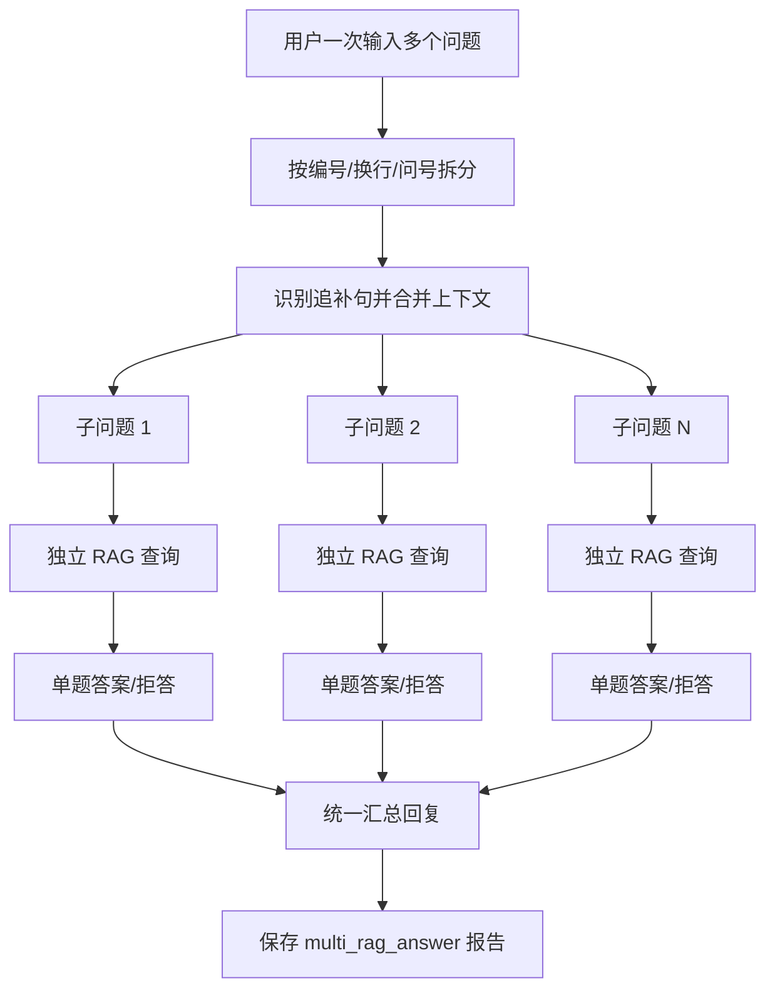
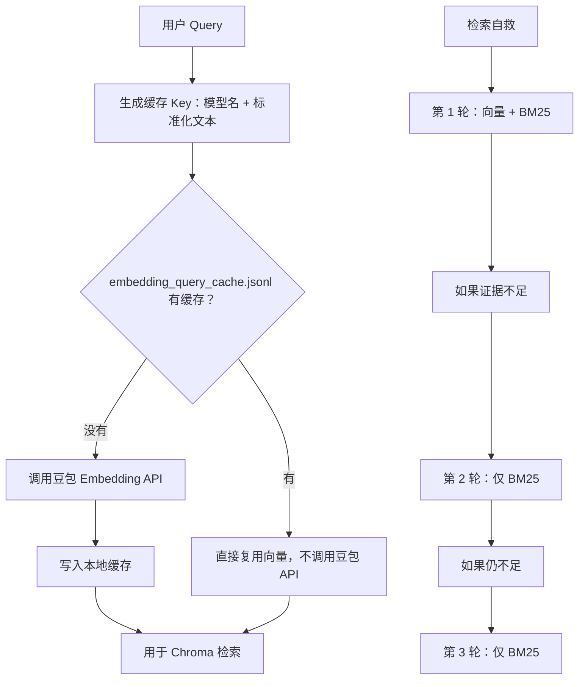
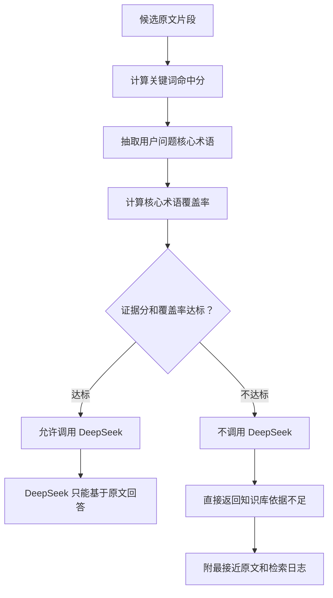
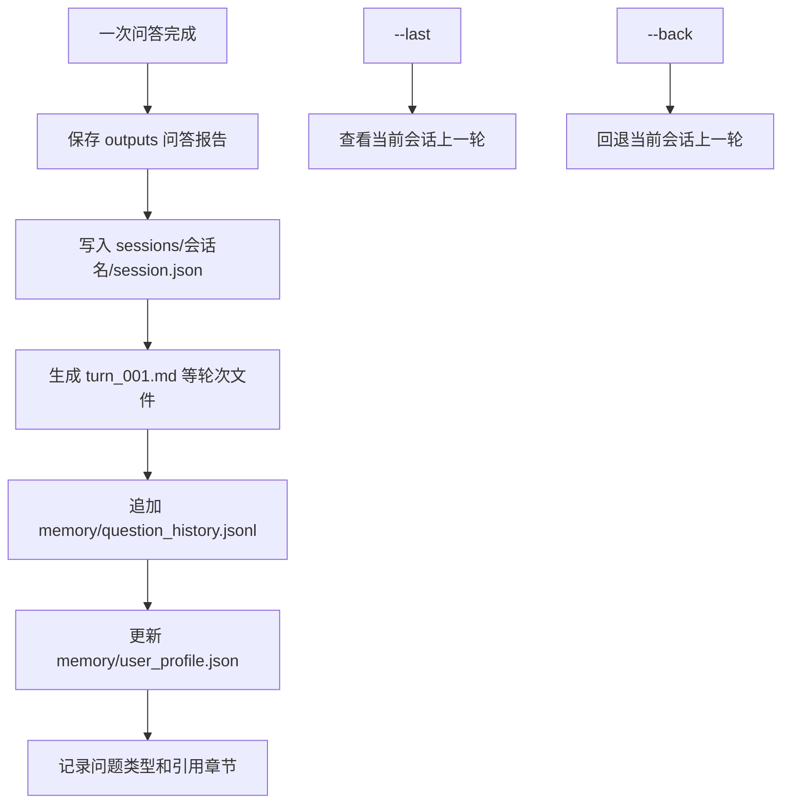

# RAG 智能基础版 v0.2 流程图

说明：这个文件是新版本流程图，旧版 `RAG完整流程图.md` 保留不动。

## 总览



## 离线建库阶段



## 在线单问题查询



## 一次多个问题



## 省钱机制



## 防胡说机制



## 会话和长期记忆



## 当前边界

```text
已经完成：
  1. 文档切分和索引构建
  2. 豆包 embedding + Chroma 向量检索
  3. BM25 中文关键词检索
  4. DeepSeek 保守回答
  5. 检索自救
  6. 证据不足拒答
  7. Query embedding 缓存
  8. 多问题拆分和统一回复
  9. 会话历史、上一轮查看、上一轮回退
  10. 长期学习记录基础

暂未完成：
  1. Web UI
  2. 长期记忆参与下一次回答
  3. 错题本和复习卡片
  4. 更大规模评估集
  5. 专业 reranker 二次重排
```
