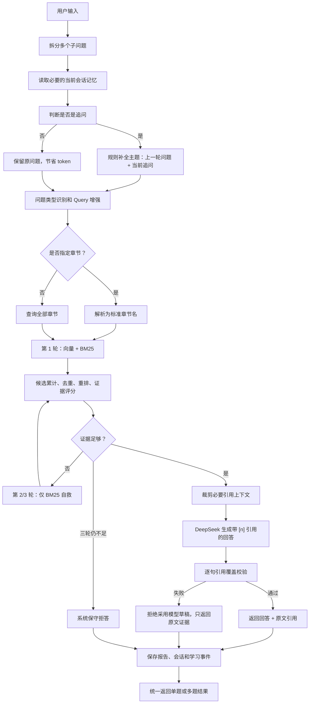
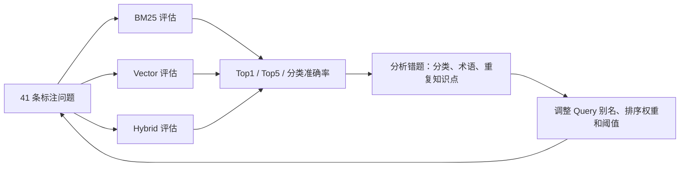
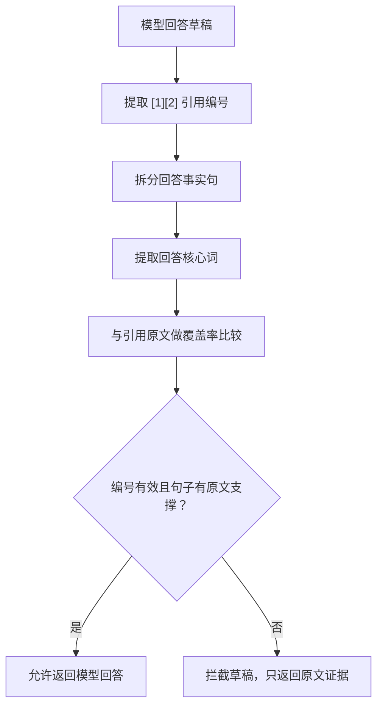

# RAG 智能基础版 v0.3 流程图

说明：v0.2 流程图保留不变。本版本增加评估集、章节过滤、会话追问补全、累计候选和严格引用校验。

## 总体在线流程

```mermaid
flowchart TD
    A["用户输入"] --> B["拆分多个子问题"]
    B --> C["读取必要的当前会话记忆"]
    C --> D["判断是否是追问"]
    D -->|是| E["规则补全主题：上一轮问题 + 当前追问"]
    D -->|否| F["保留原问题，节省 token"]
    E --> G["问题类型识别和 Query 增强"]
    F --> G
    G --> H{"是否指定章节？"}
    H -->|是| I["解析为标准章节名"]
    H -->|否| J["查询全部章节"]
    I --> K["第 1 轮：向量 + BM25"]
    J --> K
    K --> L["候选累计、去重、重排、证据评分"]
    L --> M{"证据足够？"}
    M -->|否| N["第 2/3 轮：仅 BM25 自救"]
    N --> L
    M -->|是| O["裁剪必要引用上下文"]
    O --> P["DeepSeek 生成带 [n] 引用的回答"]
    P --> Q["逐句引用覆盖校验"]
    Q -->|通过| R["返回回答 + 原文引用"]
    Q -->|失败| S["拒绝采用模型草稿，只返回原文证据"]
    M -->|三轮仍不足| T["系统保守拒答"]
    R --> U["保存报告、会话和学习事件"]
    S --> U
    T --> U
    U --> V["统一返回单题或多题结果"]
```

## 评估与优化流程

```mermaid
flowchart LR
    A["41 条标注问题"] --> B["BM25 评估"]
    A --> C["Vector 评估"]
    A --> D["Hybrid 评估"]
    B --> E["Top1 / Top5 / 分类准确率"]
    C --> E
    D --> E
    E --> F["分析错题：分类、术语、重复知识点"]
    F --> G["调整 Query 别名、排序权重和阈值"]
    G --> A
```

## 严格引用校验

```mermaid
flowchart TD
    A["模型回答草稿"] --> B["提取 [1][2] 引用编号"]
    B --> C["拆分回答事实句"]
    C --> D["提取回答核心词"]
    D --> E["与引用原文做覆盖率比较"]
    E --> F{"编号有效且句子有原文支撑？"}
    F -->|是| G["允许返回模型回答"]
    F -->|否| H["拦截草稿，只返回原文证据"]
```

## 本版本明确不做

- 回退后自动重算长期画像。
- 错题本、复习卡片和 Web UI。
- 专业 reranker。
