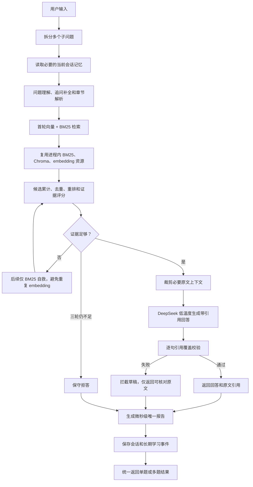
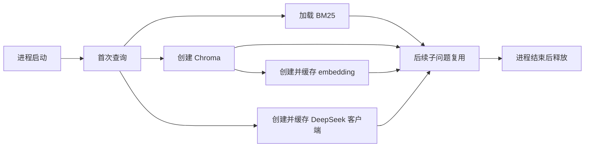
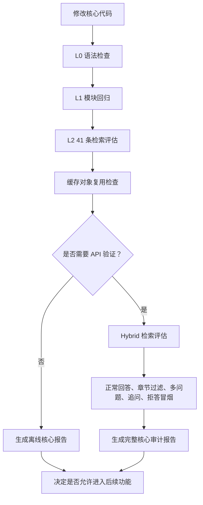

# RAG 智能基础版 v0.4 流程图

说明：v0.2、v0.3 流程图全部保留。本版本主要记录核心代码收敛：运行时资源复用、报告唯一性和统一测试门禁。

## 在线查询流程

```mermaid
flowchart TD
    A["用户输入"] --> B["拆分多个子问题"]
    B --> C["读取必要的当前会话记忆"]
    C --> D["问题理解、追问补全和章节解析"]
    D --> E["首轮向量 + BM25 检索"]
    E --> F["复用进程内 BM25、Chroma、embedding 资源"]
    F --> G["候选累计、去重、重排和证据评分"]
    G --> H{"证据足够？"}
    H -->|否| I["后续仅 BM25 自救，避免重复 embedding"]
    I --> G
    H -->|是| J["裁剪必要原文上下文"]
    J --> K["DeepSeek 低温度生成带引用回答"]
    K --> L["逐句引用覆盖校验"]
    L -->|通过| M["返回回答和原文引用"]
    L -->|失败| N["拦截草稿，仅返回可核对原文"]
    H -->|三轮仍不足| O["保守拒答"]
    M --> P["生成微秒级唯一报告"]
    N --> P
    O --> P
    P --> Q["保存会话和长期学习事件"]
    Q --> R["统一返回单题或多题结果"]
```

## 资源生命周期

```mermaid
flowchart LR
    A["进程启动"] --> B["首次查询"]
    B --> C["加载 BM25"]
    B --> D["创建 Chroma"]
    D --> E["创建并缓存 embedding"]
    B --> F["创建并缓存 DeepSeek 客户端"]
    C --> G["后续子问题复用"]
    D --> G
    E --> G
    F --> G
    G --> H["进程结束后释放"]
```

## 总结测试门禁

```mermaid
flowchart TD
    A["修改核心代码"] --> B["L0 语法检查"]
    B --> C["L1 模块回归"]
    C --> D["L2 41 条检索评估"]
    D --> E["缓存对象复用检查"]
    E --> F{"是否需要 API 验证？"}
    F -->|否| G["生成离线核心报告"]
    F -->|是| H["Hybrid 检索评估"]
    H --> I["正常回答、章节过滤、多问题、追问、拒答冒烟"]
    I --> J["生成完整核心审计报告"]
    G --> K["决定是否允许进入后续功能"]
    J --> K
```

## 本版本仍然不做

- 回退后自动重算长期画像和问题历史。
- 错题本、复习卡片和 Web UI。
- 专业 reranker。
