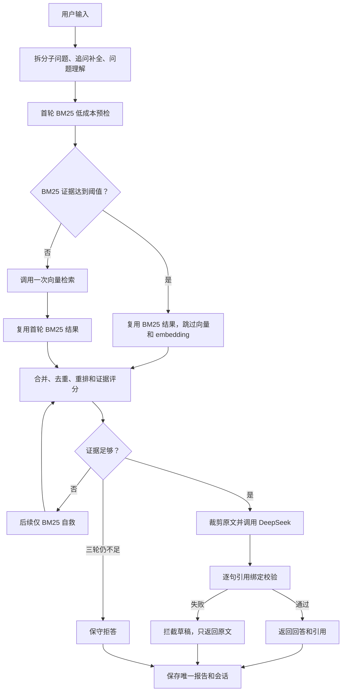
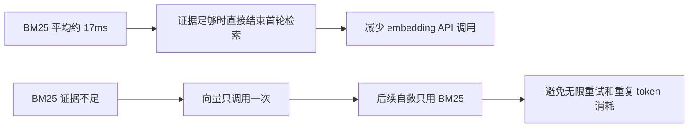

# RAG 智能基础版 v0.5 流程图

说明：v0.2、v0.3、v0.4 流程图全部保留。本版本记录 BM25 预检门控和自适应向量检索，目标是减少不必要的 embedding 调用。

## 自适应在线查询流程

## 成本控制点

## 本版本验收重点

- 关键词明确的问题优先走 BM25。
- BM25 不足的问题仍然可以进入向量检索。
- 向量检索进入后不重复执行已经完成的 BM25 查询。
- 41 条评估题中，当前 40 条预检达到证据阈值，预计可跳过 97.6% 的首轮向量调用。
- 完整 API 模式下正常回答、章节过滤、多问题、追问和证据不足拒答全部通过。

## 本版本仍然不做

- 回退后自动重算长期画像和问题历史。
- 错题本、复习卡片和 Web UI。
- 多进程共享缓存和并发调度。
