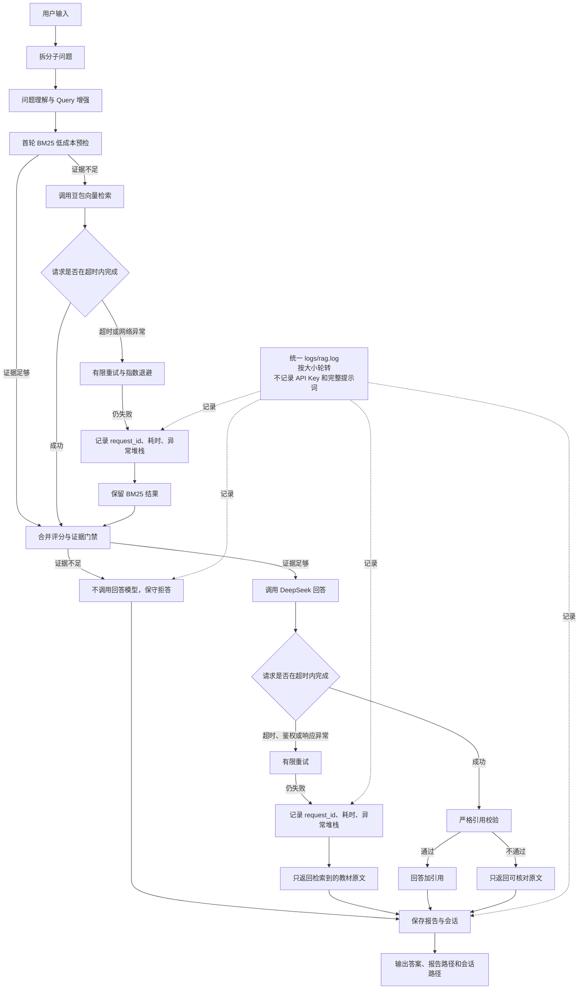

# RAG 智能基础版 v0.6 流程图：请求超时与异常治理

本版本保留 `RAG智能基础版v0.5流程图.md`，只在运行时请求、异常记录和失败降级处增加治理环节。

## 关键边界

1. 超时由模型客户端或 HTTP 请求本身控制，避免网络调用无限等待。
2. 重试次数有限，避免服务异常时无限消耗 token 和时间。
3. 检索异常不会直接编造答案，最终由证据门禁决定拒答还是继续。
4. 回答模型异常时，系统只展示已检索原文；模型不可用不会被伪装成正常回答。
5. 日志保存诊断信息，回答报告保存业务结果，两者职责分开。
